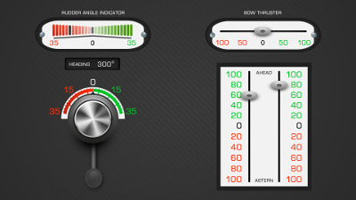

Virtual Handles
===============

*Authors: Uwe Gruenefeld, Tim Claudius Stratmann, Julia Stratmann*

**General Description**

Screen-based Virtual Handles and Information Displays for Ship Bridge Simulators

A Node.js server handles data exchange and delivers different views as HTML files accessable per name.
We use [Socket.IO](https://github.com/socketio/socket.io) for communication between views and the simulation.
The folder *client-examples* includes code snippets in Java and Python, as well as a full example integration into the open source interactive 3D ship simulator [BridgeCommand](https://github.com/bridgecommand/bc).

**Model Description**

The assigned *id* of the element is used as variable name for setting the value, depending on the type of the element further values are adressed by *id*-*name*, e.g. for the element of type *gps* with the id *myGPS* the value *course* is adressed by *myGPS-course*.

*The full model of the initially supplied Virtual Handels*
```javascript
{
	"rudder-angle-indicator": 0,
	
	"turn-rate": 0,
	
	"heeling": 0,

	"heading": 300.0,

	"bow-thruster": 0,
	
	"machine-telegraph-left": 20,
	"machine-telegraph-right": 20,

	"rudder": 0,

	"echolot": 10.5,

	"vhf-watt": 25,
	"vhf-channel": 16,
	"vhf-coord-north": "53' 32.521",
	"vhf-coord-east": "8' 42.341",

	"gps-coord-north": "53' 32.521",
	"gps-coord-east": "8' 42.341",
	"gps-course": 300.0,
	"gps-speed": 10.5,

	"log-speed": 9.5,
	"log-trip": 45.6
}
```

HowTo create new interface,...

**HTML-Template Example**
```html
<!DOCTYPE html>
<html xmlns="http://www.w3.org/1999/xhtml" lang="de" xml:lang="de">
	<head>
		<title>Center Screen</title>
		
		<meta name="viewport" content="width=device-width, initial-scale=1.0, user-scalable=no" />
		<link rel="stylesheet" href="./style/elements.css" />
		
		<script src="socket.io/socket.io.js"></script>
		<script src="./script/jquery-2.2.0.min.js"></script>
		<script src="./script/controller.js"></script>
	</head>
	<body>
		<div id="container"></div>

		<script>
			
			<!-- RUDDER ANGLE INDICATOR -->
			showScale("rudder-angle-indicator", 35, "RUDDER ANGLE INDICATOR", 400, "margin-top:30px;");
			
			<!-- BOW THRUSTER -->
			showSliderHorizontal("bow-thruster", 100, "BOW THRUSTER", 400, "margin-top:30px;margin-left:195px;");
				
			<!-- HEADING -->
			showHeading("heading", 230, "margin-top:30px;margin-left:85px;");
			
			<!-- MACHINE TELEGRAPH -->
			showMachineTelegraph("machine-telegraph", 340, "float:right;margin-top:40px;margin-right:30px;", true);
			
			<!-- RUDDER -->
			showRudder("rudder", 360, "margin-left:20px;margin-top:30px;");
			
		</script>
	</body>
</html>
```
**Result**



